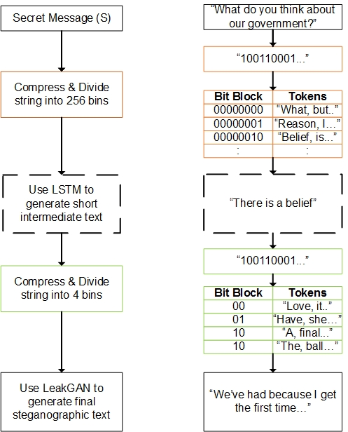

# Steganography for sequential data

The main aim of this project is to test double layer of encoding and LeakGAN and RNN models for sequential steganographic system. In particular we have concentrated on 
generating steganographic text, as a test case of sequential data. This project can be used to tackle censorship and targeted ads issues when exchanging textual messages through the messengers and email services.

The figure below provides high level description of the system, assuming that the messenger services use end-to-end encryption (E2E).


## How Double Layer of Encoding Works

The diagram below depicts how double layer of encoding works on a high level



## Requirements
* **PyTorch r1.1.0**
* Python 3.5+
* CUDA 8.0+ (For GPU)

## Training 

To start training LeakGAN model on EMNLP data run following commands:

`mkdir save pretrain savefig` to save the progress of training

`python3 train_leakgan.py 2`

To start the training LSTM model on EMNLP data run following commands:

`cd LSTM`

`python3 main.py`

## Generation 

To generate stego text using EMNLP_NEWS dataset & and double layer of encoding run following commmand:

`python3 generate.py 2`

The default double layer of encoding uses LSTM - LSTM double layer. In order to change it into LSTM - LeakGAN double layer, change the command leakGAN option in `generate.py` to `int(True)`

If you want to test the system with pretrained models, the models are saved in `instructor/real_data` directory

`emnlp_news.pt` is the LSTM model trained on EMNLP news dataset

`gen_ADV_00028.pt` is the LeakGAN model trained on EMNLP news dataset

## Evaluation

### BLEU Score
In order to calculate bleu score of LSTM-LeakGAN Double layer of encoding run following command:

`python3 bleu_score.py --leakGAN`

In order to calculate bleu score of LSTM-LSTM Double layer of encoding run following command:

`python3 bleu_score.py --test_data='./decode/final_lstm.txt'`

The program will calculate up to BLEU 5 score as a default. In order to change up to which BLEU score you would like to calculate enter following command:

`python3 bleu_score.py --gram=3`

This will calculate up to BLEU 3 score

## Reference
You can find more details on how LeakGAN model works in following paper:
```bash
@article{guo2017long,
  title={Long Text Generation via Adversarial Training with Leaked Information},
  author={Guo, Jiaxian and Lu, Sidi and Cai, Han and Zhang, Weinan and Yu, Yong and Wang, Jun},
  journal={arXiv preprint arXiv:1709.08624},
  year={2017}
}
```

One of the research works that considers similar theme can be found using this [link](https://github.com/tbfang/steganography-lstm)

## Acknoledgements:
1. [LeakGAN Model](https://github.com/williamSYSU/TextGAN-PyTorch) was mainly using this resource
2. [RNN](https://github.com/pytorch/examples/tree/master/word_language_model)

Copyright (c) 2019 Nurpeiis Baimukan
